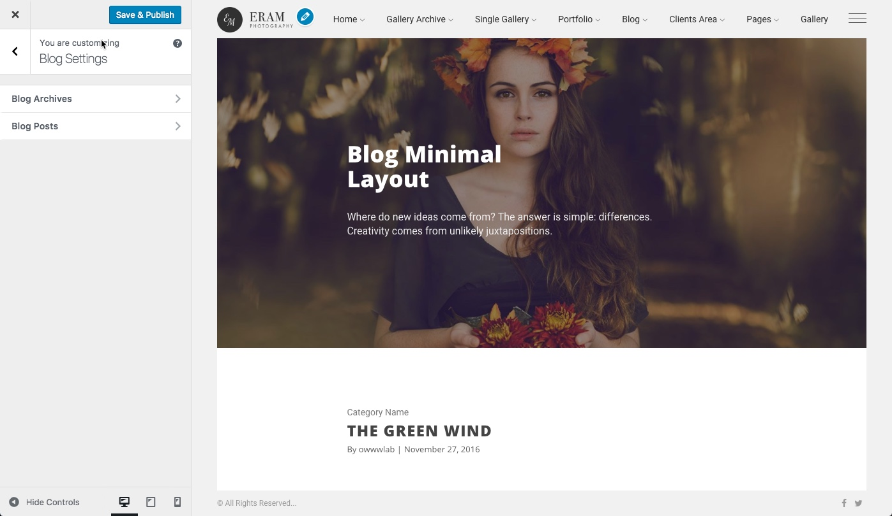

# ‌Blog

The blog page is essential and Eram takes that seriously. There are 3 layouts for blog archive pages and 3 layouts for blog posts added to tons options available for each one of them all provided as the WordPress Customizer options which make it really easy to use and comprehend.

Next we will take a look at single blog post and archive settings.

