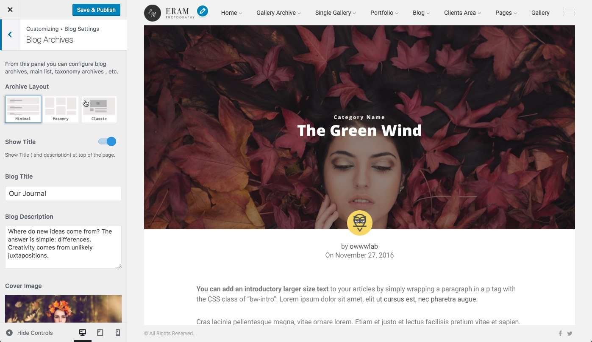

# Archives

All settings related to blog archive pages including main list, categories, tag list and author posts can be found at _WP Customizer &gt; Blog Settings &gt; Blog Archives_

You can adjust

* Layout
  * Minimal
  * Masonry
  * Classic
* Sidebar
* Title
* Descripiton
* Cover Image
* Show/hide
  * caregories
  * author
  * date

