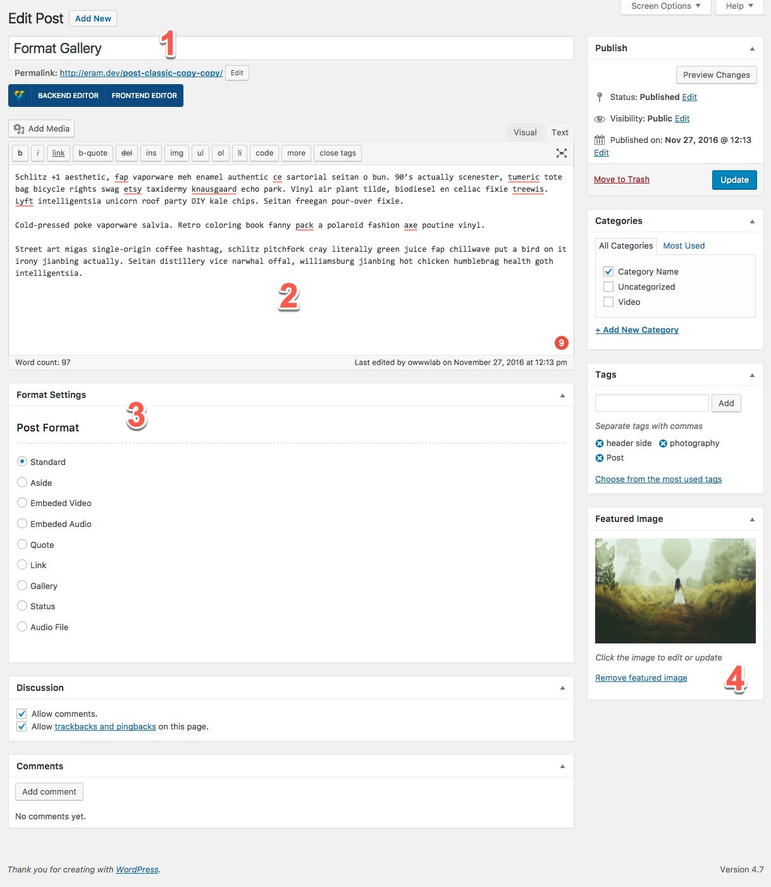
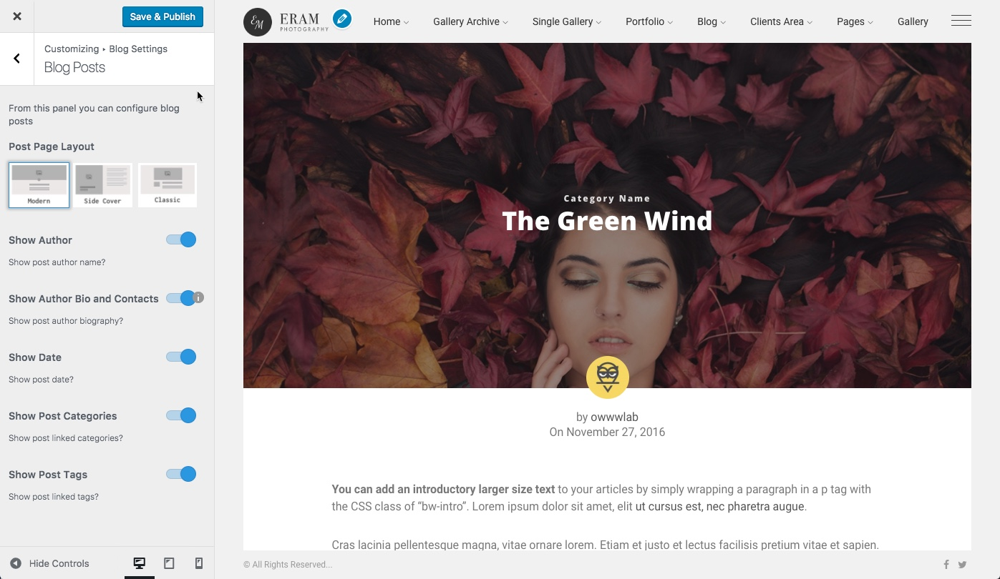

# Post

As a post there are some settings for a post. Following figure demonstrate the post admin page.

1. The title of the post
2. The content of the post
3. Format settings
4. Cover image

## Post Formats

There are 9 different formats offered by Eram theme.

### Standard

Standard post format is an ordinary post format with no extera information.

### Aside

Aside post format is used when you do not actually want to publish a post but a simple sentence with few words to notify your readers about something.

### Embeded Video

This is to add a video from external video services like Youtube and Vimeo. You just need to provide the URL of the video. Here is the updated list of supported external services [https://codex.wordpress.org/Embeds](https://codex.wordpress.org/Embeds).

### Embeded Audio

This is to add a audio from external video services. You just need to provide the URL of the audio. Here is the updated list of supported external services [https://codex.wordpress.org/Embeds](https://codex.wordpress.org/Embeds).

### Quote

This post format is used to have a post as a quote which will shine among your other posts in the list.

### Link

This is used when you want to introduce a website or a link.

### Gallery

This post format is used to add a carousel gallery into your post.

### Audio File

If you have a mp3 audio file and want to let your audience listen to it, like a podcast, you can use this one.

## Post layout and options

There are three layouts for posts which you can choose from at Wordpress _Customizer &gt; Blog Settings &gt; Blog Posts_

* Modern
* Side Cover
* Classic

These settings are share for all posts along with other setting that are shown in the following figure.

