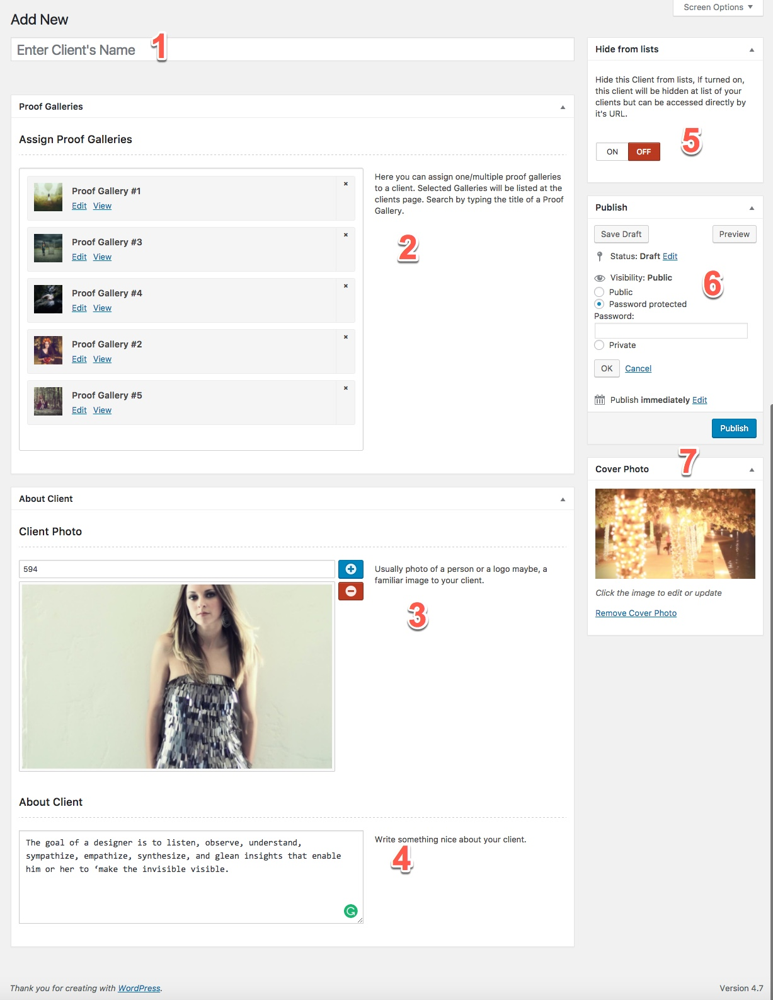
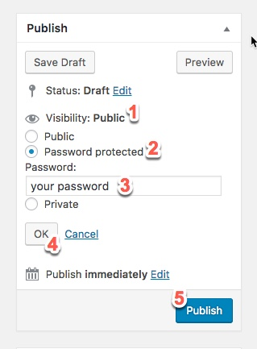
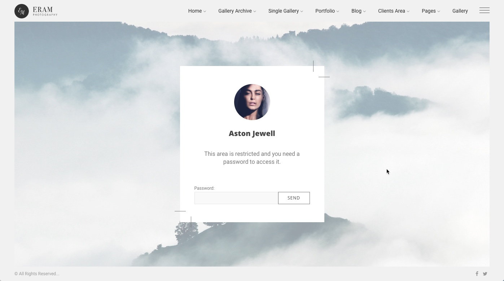
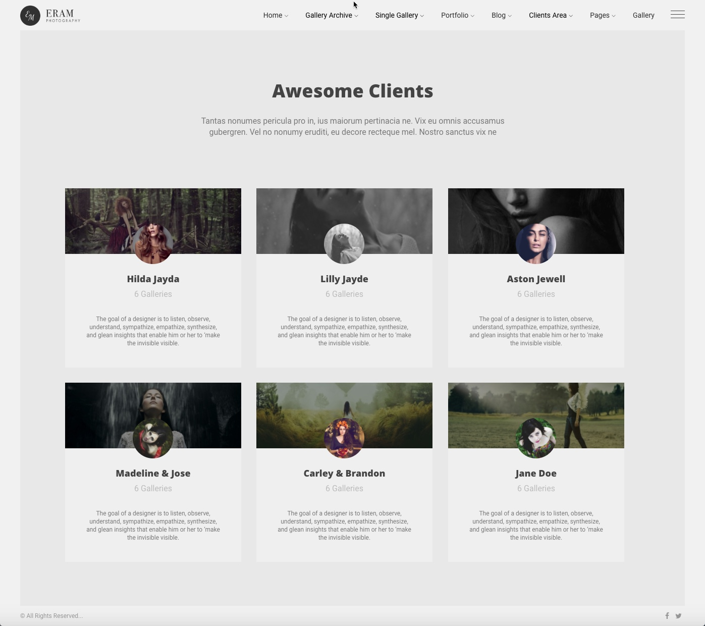
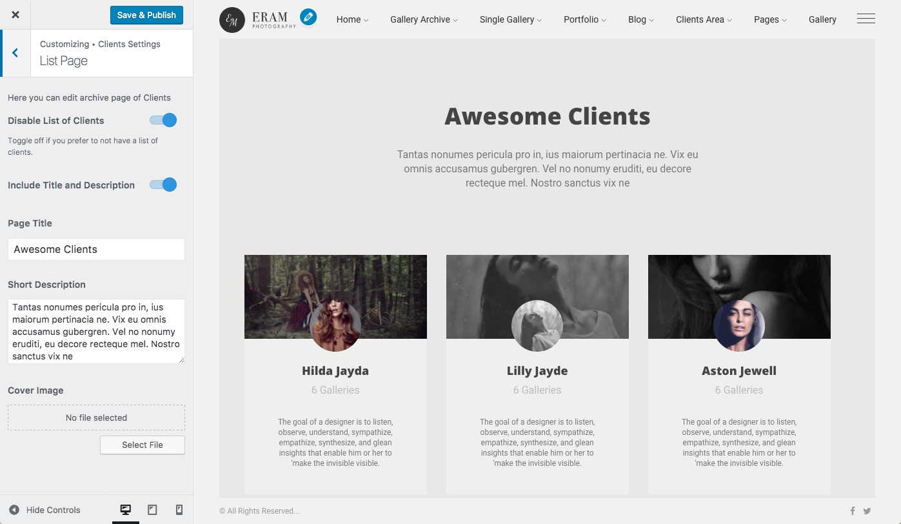

# Clients

Clients are the core part of your photography bussieness Here are the list of features that are offered by the Eram theme to cover your needs as much as globaly possible.

* Display a list of your clients linked to individual page
* Display a specific page for each client listing assigned proof galleries.
* Password Protecting a client
* Secret clients. We realize that displaying a client to your website might not be on your contract. So, you can hide them from public, still providing their page and their proof galleries.

## How to add a client

1. Name of the client
2. Assign Proof galleries. After you added some proof galleries you can assing one or more proof galleries to a client, so that, they can access them all in one place.
3. This is an avatar, logo or client photo.
4. A short description about the client.
5. **Hidden client** this allows you to hide this client from public by still is accessible by direct link to that page. You can make this client password protected to gain the maximum invisibility for it.
6. Publish metabox
7. Cover image for client.

## How to make a client page Password Protected

Just like any other page in WordPress you can click on Visibility and set a password for any individual proof gallery.

When a visitor wants to access this page, they should provide the password.

## How List of clients page is look like

You can customize this page at WordPress _Customizer &gt; Clients Settings &gt; List Page_

