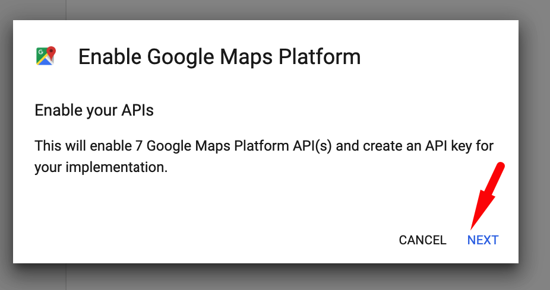

# Configure Google Maps

### Go to [Google Maps Platform](https://cloud.google.com/maps-platform/?apis=maps) and click on the  

### Create a new project

### Follow the Billing stuff there

### Enable Google Maps Platform

### Coopy your API key

### Enable Geocoding API

### Secure your API key

