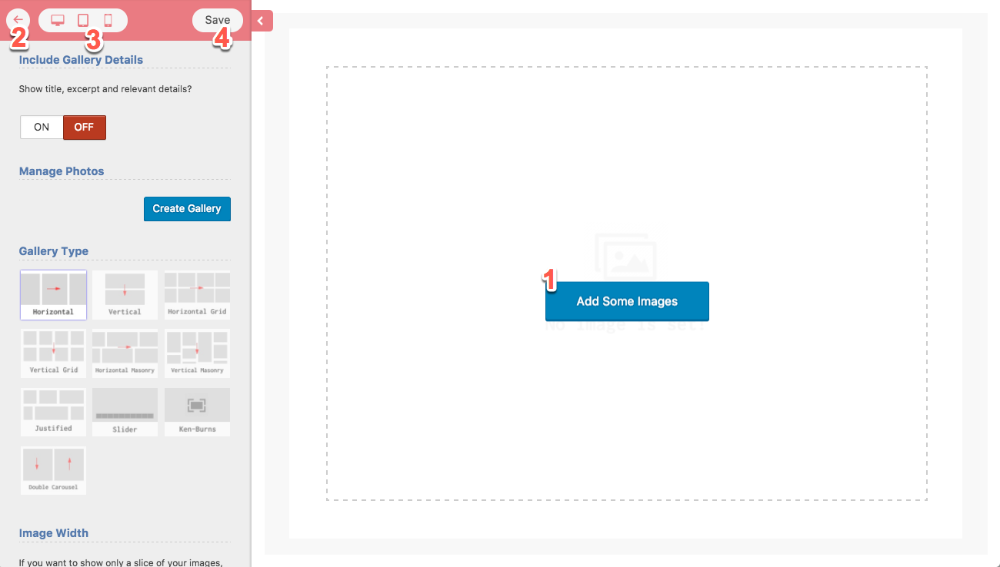
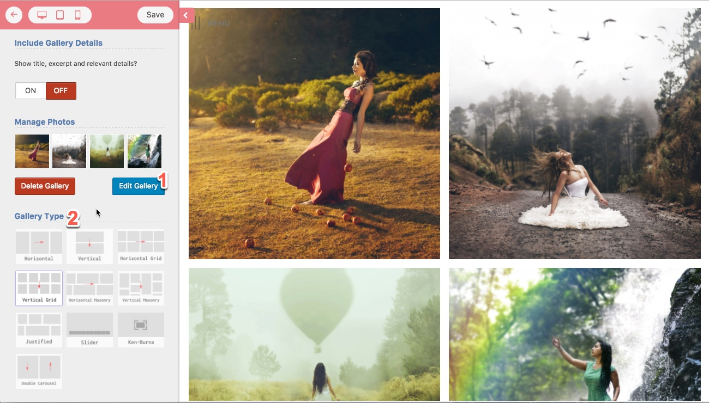
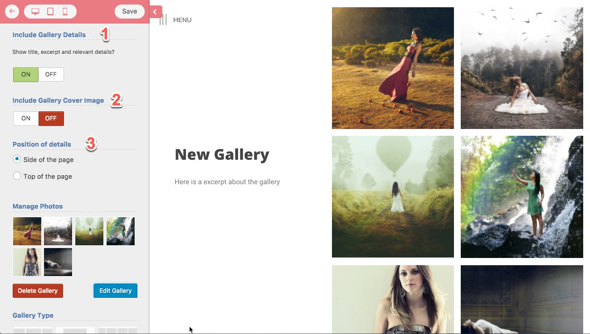
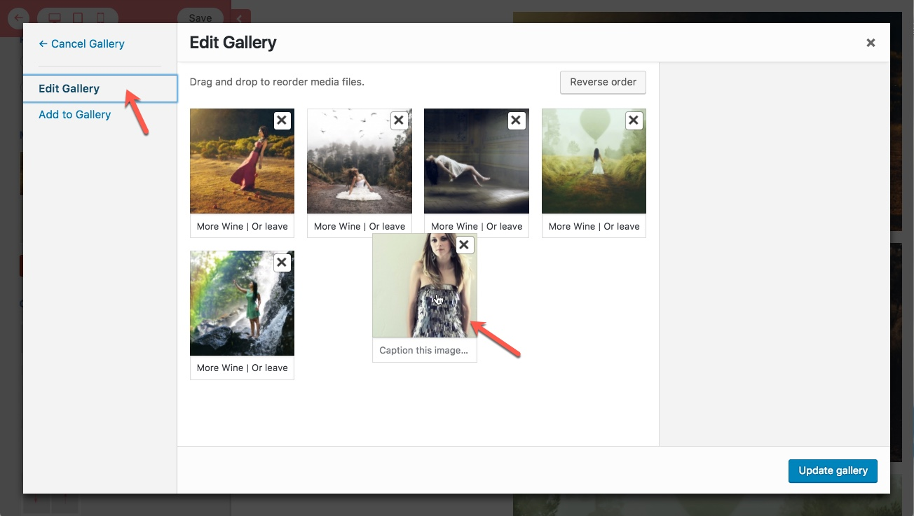

# Customize Gallery

## Customize the Gallery

Eram offers a live gallery customizer and this is a great feature because almost all of the settings are related to visual style and layout, that said it is very useful to see the effect when you change an option, this is really easy with Eram.

The following figure demonstrates the live gallery customizer, you can do this by clicking on the **Customize Gallery** link at the edit page of the gallery.

1. Click on this button to add or edit gallery images, you can upload new photos or use existing photos at media library
2. Back button to edit page
3. Responsive preview
4. Save button

## Gallery Types

  
Above photo shows gallery types.

* Simple Horizontal
* Simple Vertical
* Horizontal Grid
* Vertical Grid
* Horizontal Masonry
* Vertical Masonry
* Justified
* Slider
* Kenburn Slider
* Double Carousel

After adding photos and selecting the gallery type, you can set other settings related to the gallery type.

## Add/Remove Header or Sidebar

You can add Header or sidebars to your gallery which is demonstrated at bellow figure.  

1. If you want to have title and description at sidebar or header, turn this on.
2. This adds the _featured image_ of the gallery to background of the details area and
3. You can choose if you want them to be at sidebar or at the top of the page.

**Note:** Some gallery types like slider don't offer that option since they are naturally full-screen.

## Ordering of photos

You might think of how to change the ordering of photos in a gallery. It is done using drag & drop while adding and editing photos of a gallery. At the live gallery customizer page, click on **Edit Gallery** and there you can drag & drop to order photos as you wish.

## Lightbox

There are two lightbox mode available in Eram, basic and advanced. Advanced mode is useful if you want to show more details about each image like description, EXIF data, etc.

Sidebar can be shown by turning on the "Show Lightbox Sidebar" option for each gallery and it's settings are global and available in _dashboard-&gt;appearance-&gt;customize-&gt;gallery settings-&gt;lightbox_

