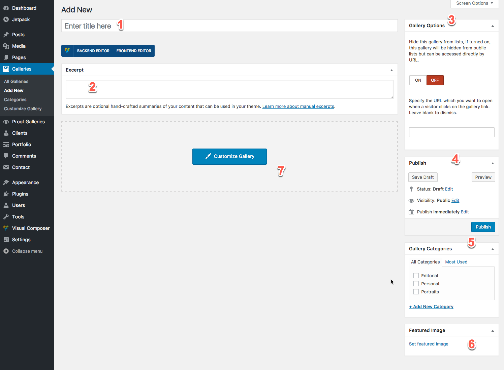

# Add new gallery

Go to admin panel and under Gallery menu click on Add New. Let's introduce you with this page:

  
Above is the **Add New Gallery** page, bellow you can find the description of numbered elements in the figure.

1. The title of the gallery
2. A very short \(50 words\) description of the gallery if needed
3. Gallery Options
4. Hides the gallery from archive pages and also search
5. Second option is used rarely if you need to show completely different page instead of the normal gallery page, you can input the full URL of that page.
6. Is the normal Publish meta box of WordPress and here you can publish, make the gallery private, set password and so on, that is the visitor will be redirected to your specified URL instead of the normal one upon clicking on this gallery at lists.
7. Lets you organize your galleries with categories.
8. This is the cover image or featured image of the gallery that is usually used for the cover thumbnail image and the header image of the gallery.
9. All gallery settings are placed here. Click on it to add images and build your gallery.

Next step is adding your images and customizing gallery options which has been covered in the next article.

