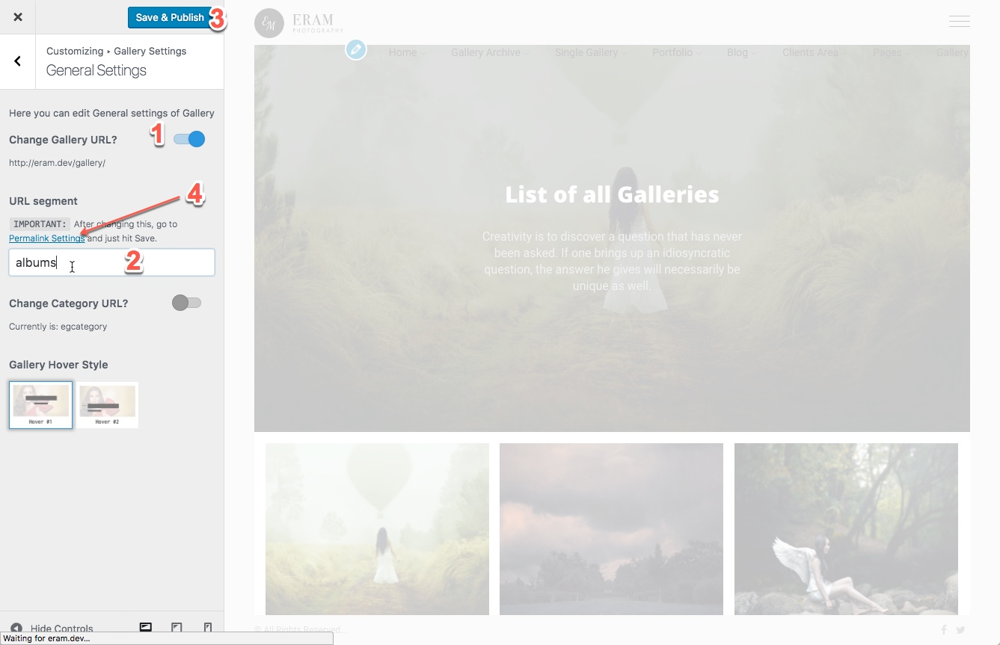

# Change gallery URL

You can change the URL of gallery, for example, your gallery is accessed by default at:

```text
http://yourwebsite.com/gallery
```

Now you can change it to

```text
http://yourwebsite.com/albums
```

How to do that is simple:

1. Go to WordPress Customizer &gt; Gallery Settings &gt; General Settings and toggle on **Change Gallery URL**
2. Change the URL Segment field from gallery to albums
3. Click on Save & publish
4. Click on Permalink Settings URL and you need to hit Save on that page to refresh the permalinks.

**Note:** URL Segment field must be URL friendly, avoid spaces, capital letters, and special characters.



Similarly, you can change the category permalinks using the **Change Category URL** option.

