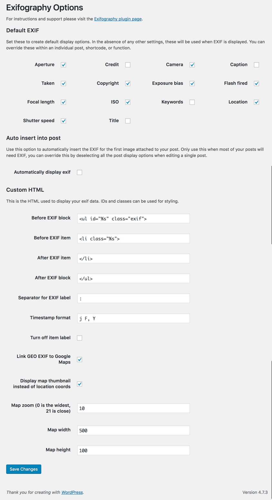
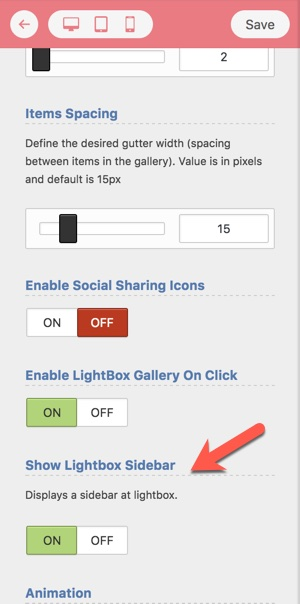

# EXIF Metadata

In order to display EXIF metadata of your photos at Lightbox:

## 1-  Install and activate the [Exifography](https://wordpress.org/plugins/thesography/) plugin

You can find the plugin by searching for "Exifography" while you are at the Plugins &gt; Add New Page.

## 2- Check Plugin Settings

Below is the default settings for this plugin that works well with the theme.

## 3- Configure the gallery to use sidebar at lightbox

You can find this setting while you are at the Live Gallery Customizer page.

## 4- Configure the settings of lightbox

And if needed you can find the related settings at **Appearance &gt; Customzier &gt; Gallery Settings &gt; Lightbox**

