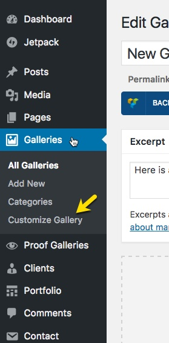
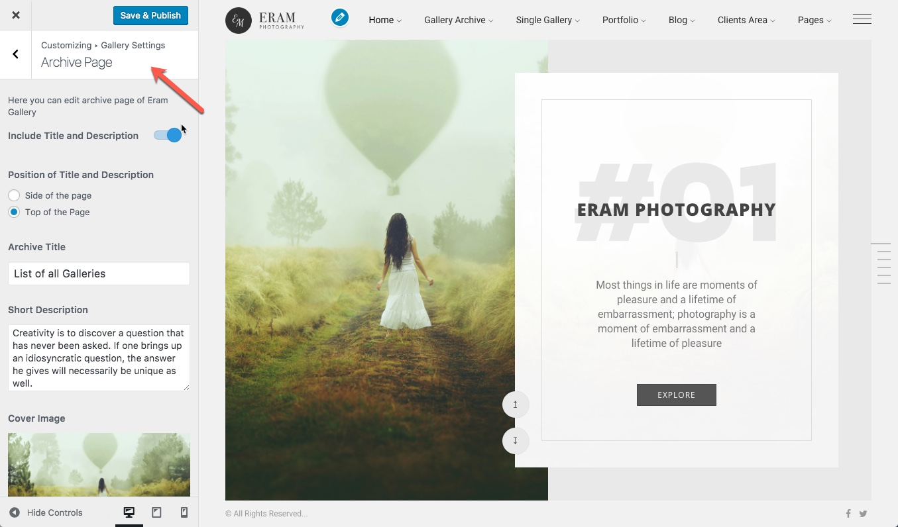

# Gallery Archive

This page lists all your galleries. You don't need to create this page since it is already there out of the box.

All settings for this page is available at WordPress Customizer. You can directly open settings for gallery section by clicking on **Customize Gallery** Link at menu under galleries.

Below is an overview of the gallery archive page settings located at _Customizer &gt; Gallery Settings &gt; Archive Page_

Here you can customize the following aspects of your gallery archive

* Modify title
* Modify Description
* Modify Cover Image
* Modify Layout
* Simple Horizontal
* Simple Vertical
* Horizontal Grid
* Vertical Grid
* Horizontal Masonry
* Vertical Masonry
* Justified
* Double Carousel
* Modify layout specific options
* Width
* Height
* Number of rows
* Number of Columns
* Spacing
* Loading Type
* etc

