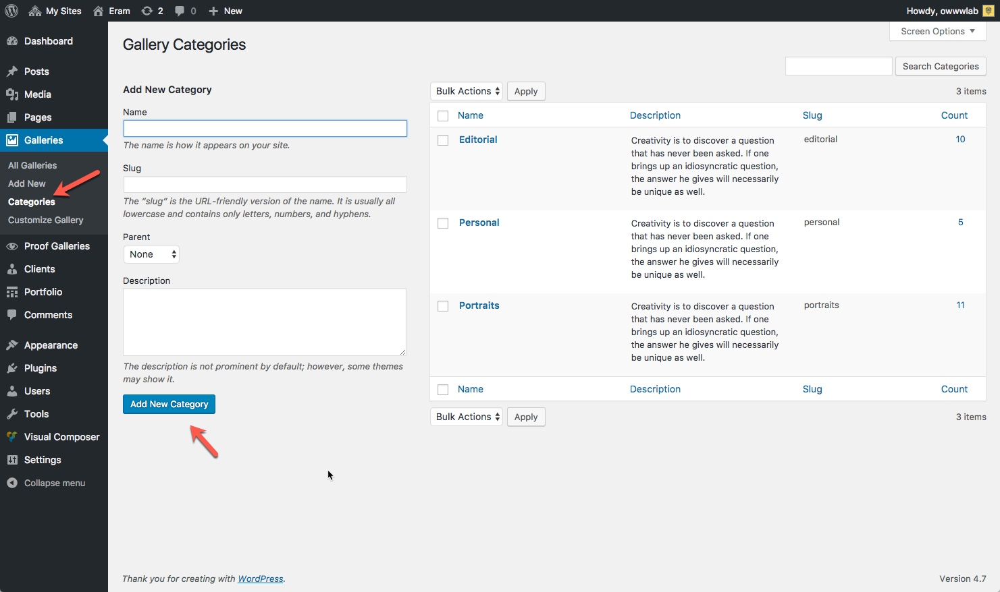
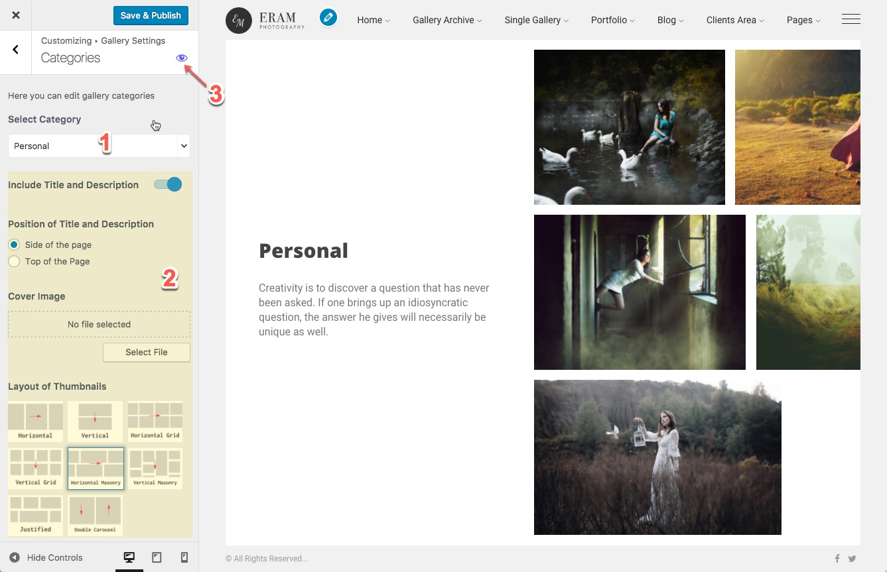

# Gallery Category

Category for the gallery is the same as a category for the blog and there is no exception. It is used to help you organize and represent your galleries in a better way.

Creating a category for gallery is easy, go to Admin &gt; Galleries &gt; Categories and create one:

Now that you have your category, you can customize the layout and find the customization options that theme offers in the WordPress Customizer under Gallery Settings panel.

You just need to select the desired category from the drop-down, it will load the settings for selected category and you can view it live.

1. Select the category to customize
2. Upon selection, the options available at the highlighted area will be updated.
3. Click on this icon to load that category into Customizer Frame.

