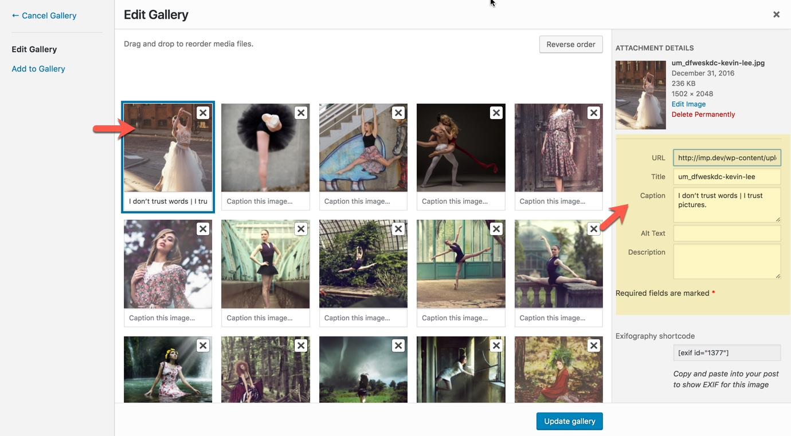

# Image title & caption

Title and captions of images can be visible in the gallery lightbox and also in some specific gallery layouts like Ken Burns and Double Carousel layouts.

Image data like title, captions, description, etc can be set in WordPress media library. Suppose you are editing a gallery with live editor, click on the image you want to add it's meta and a popup like the following screenshot will appear:

**Notice:** There are some gallery layouts like Ken Burns that the captions are in two line, one subtitle and another main caption text. In these cases the subtitle and title should be separated by \| symbol. For example I don't trust words \| I trust pictures.

