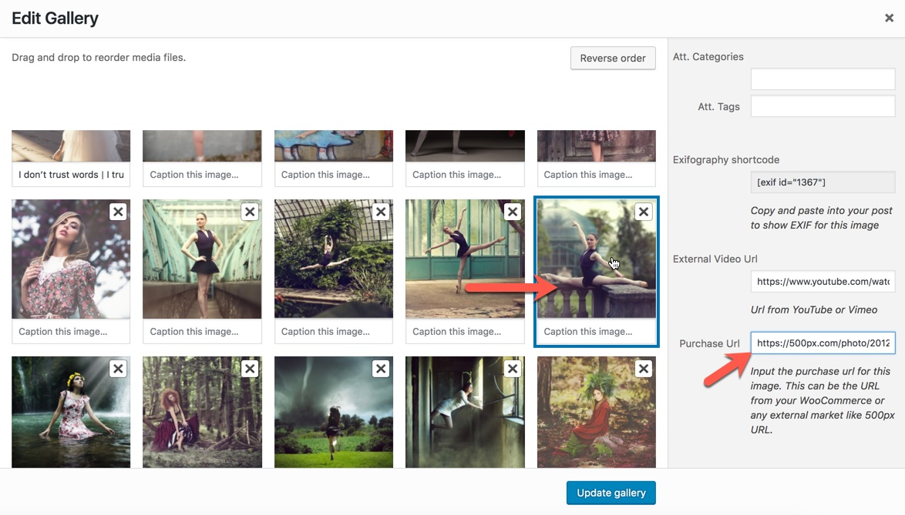
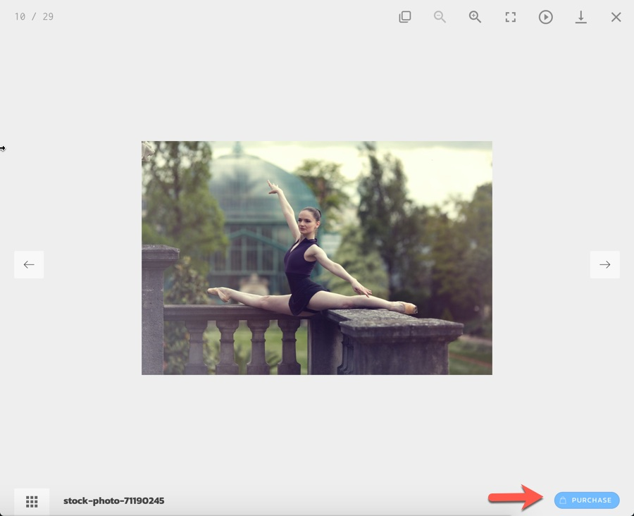

# Purchase URL

Since Eram version 2.0, you can add a purchase button to lightbox gallery for each image that will link it to image product page. The product page can be either an external shop like 500px or a WooCommerce page. In either cases we would need to enter the URL of related shop page in purchase URL field of image in media library:

After that in the lightbox mode you should see the purchase button:

