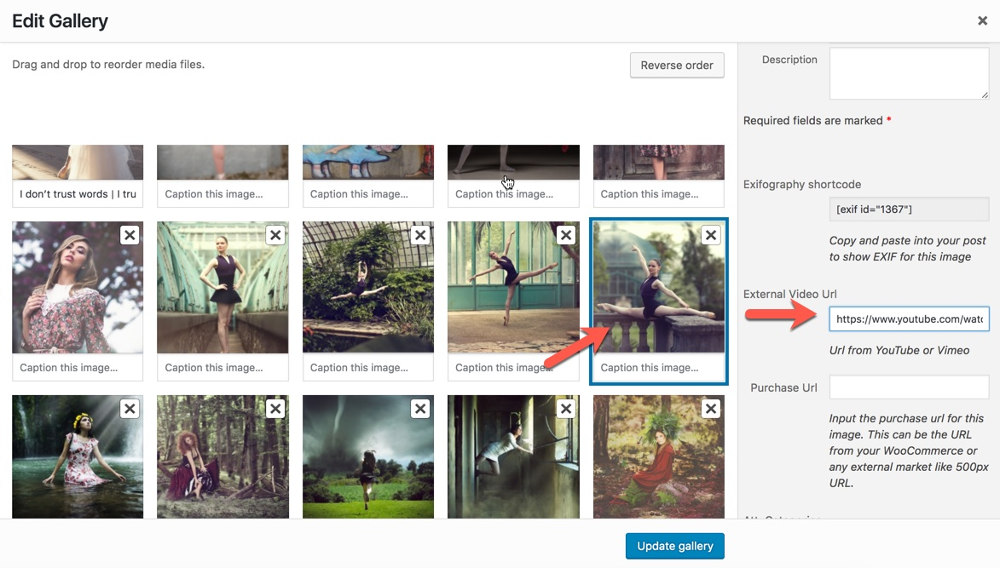
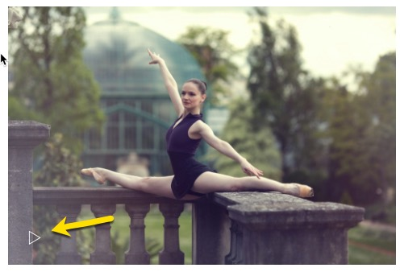

# Video URL

It is possible to attach an external video \( YouTube, Vimeo \) to a photo so that when you click on that photo at the gallery to see the enlarge photo at the lightbox gallery viewer, it will load the video instead.

You just simply need to add the URL of for example YouTube video to that image in the media library.

Then when you visit the gallery that uses that photo you will see that a play icon is added to that thumbnail and if you click on that it will load the video.

You can see a live demo here: [http://demo.owwwlab.com/eram/projects/the-across-shadow/](http://demo.owwwlab.com/eram/projects/the-across-shadow/)

