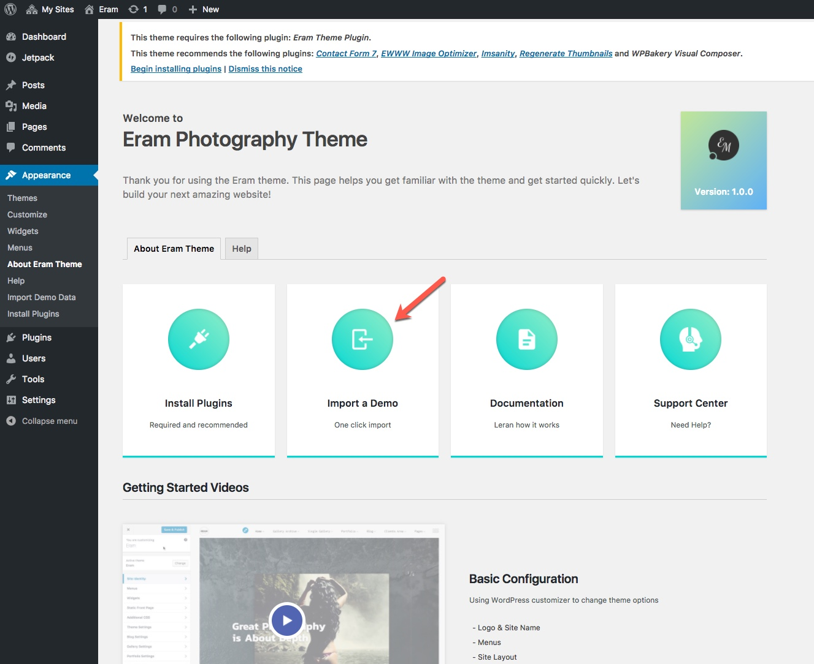
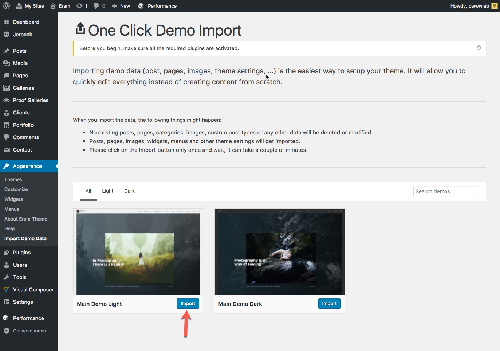

# Import a Demo

**Requirement**: You need the **One Click Demo Import plugin** installed and activated in order to continue.

From the Appearance menu or the About Eram Theme page, select the **Import Demo** and you will be presented with available demos.

Click on any demo that you want to import and all pages, posts, galleries, portfolios, widgets and theme options will be added to your website.

## You might want to Rest!

In some cases you would like to try another demo while the contents of a demo is already imported to your website. You can remove all posts, pages, etc using [WordPress Reset](https://wordpress.org/plugins/wordpress-reset/) plugin. Be aware that this plugin resets the WordPress database back to it's defaults. Deletes all customizations and content. Does not modify files only resets the database.

