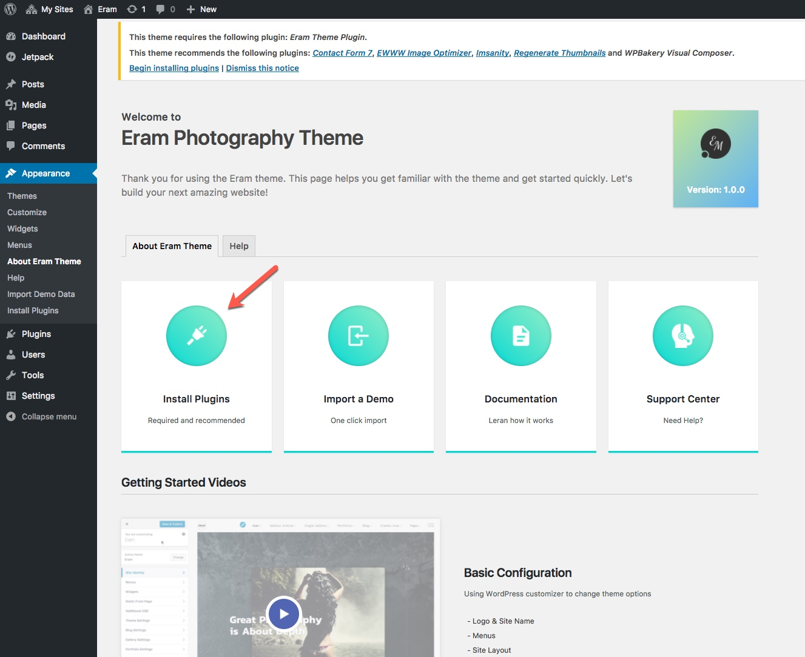
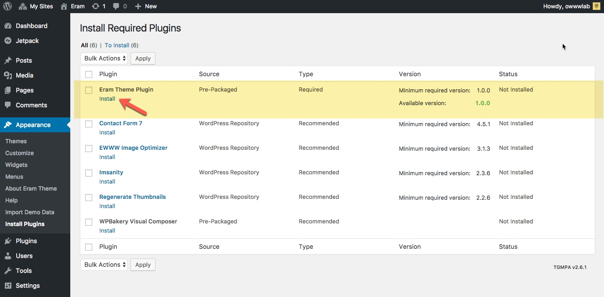

# Plugins

Upon theme activation you will see a welcome screen that will help you with the rest of the process.

Click on **Install Plugins** and install the **Eram Theme Plugin**.

## What is Eram Theme Plugin?

In WordPress terms, a theme is a theme and is responsible for styling and layouts. Taking that into account we have moved all the functionalities to a single plugin that should be installed along with the theme. Theme will work without it but it is highly recommended to install it to get these cool features:

* Galleries
* Portfolios
* Proof Galleries
* Clients

## What about other recommended plugins?

### Contact Form 7.

This is a popular plugin to make contact forms and Eram theme supports this plugin and we have used this plugin in our demos, so if you want to import a demo you need to install this plugin as well.

### Visusal Composer.

Visual Composer is a premium plugin which is included in you package for free. It is used to help you build pages with ease. It is not necessary to install it but highly recommended if you want to import a pre made demo.

### Imsanity and EWWW Image Optimizer.

These plugins help you optimize your images to a reasonable size and quality so your website load fast and still with good quality of photos. Since the quality of your photos are important to you as a photographer, please take your time to get familiar with these plugins and make the best out of them.

"Images transferred from your camera and mobile devices are usually high resolution images with image sizes reaching 3MB to 24MB+ per image. Imsanity allows you to define more reasonable image sizes for the images you upload to WordPress. This not only saves you bandwidth, but also makes your website faster with a better user experience."

"The EWWW Image Optimizer is a WordPress plugin that will automatically optimize your images as you upload them to your blog. It can optimize the images that you have already uploaded, convert your images automatically to the file format that will produce the smallest image size \(make sure you read the WARNINGS\), and optionally apply lossy compression to achieve huge savings for PNG and JPG images."

### Regenerate Thumbnails.

When you upload an image into WordPress, it makes some thumbnails with different sizes that a theme needs so if you have already images in your library, then you need to install this plugin and regenerate thumbnails.

### One Click Demo Import

This plugin is used to let you import a pre made Eram demo. Install it if you want to import a demo.

## Exifography

the [Exifography](https://wordpress.org/plugins/thesography/) plugin displays EXIF data for images uploaded with WordPress. It utilises WordPress’ own feature of storing EXIF fields in the database, and also enables import of latitude and longitude, and flash fired EXIF to the database upon image upload. Eram Theme is integrated with this plugin to display a nice list of EXIF metadata of each photo at the Lightbox and other certain locations of the pages.

