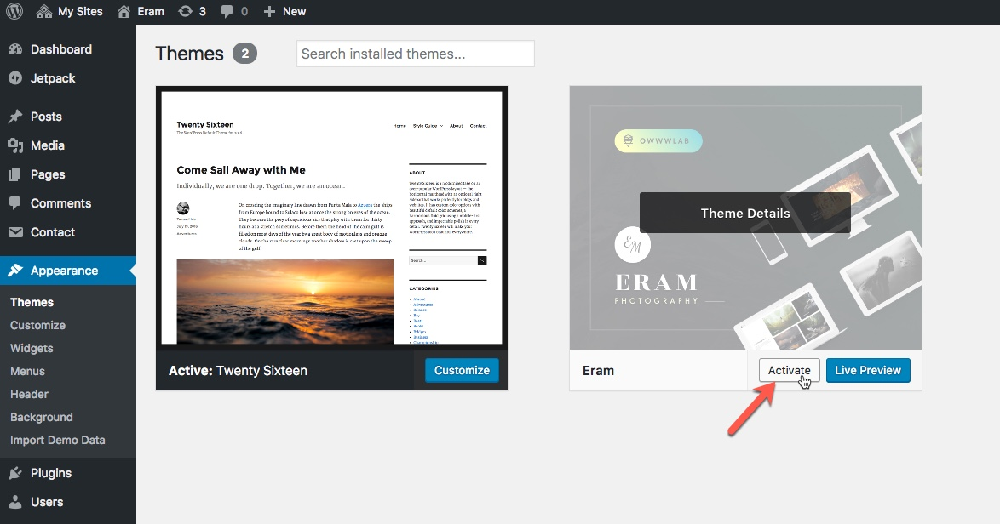

# Theme

Extract the zipped package downloaded to your desktop and find **eram-theme.zip** file. You can install the theme using admin panel or FTP.

## Installing the theme using WordPress admin panel

Please go to WordPress _admin panel -&gt; appearance -&gt; themes_ and then _Add new -&gt; upload theme_ and upload the theme zip file. After installation, you must activate the theme as well.

## Installing theme using FTP

For any reason if you failed to upload theme with WordPress admin panel, you can also do it using FTP. Unzip the theme zip file and upload “eram” folder to _WordPress root -&gt; wp-content -&gt; themes_ then go to admin _panel -&gt; appearance -&gt; themes_ and activate the Eram theme.

When you activate the theme you will be redirected to a welcome screen. There you can install required plugins.

