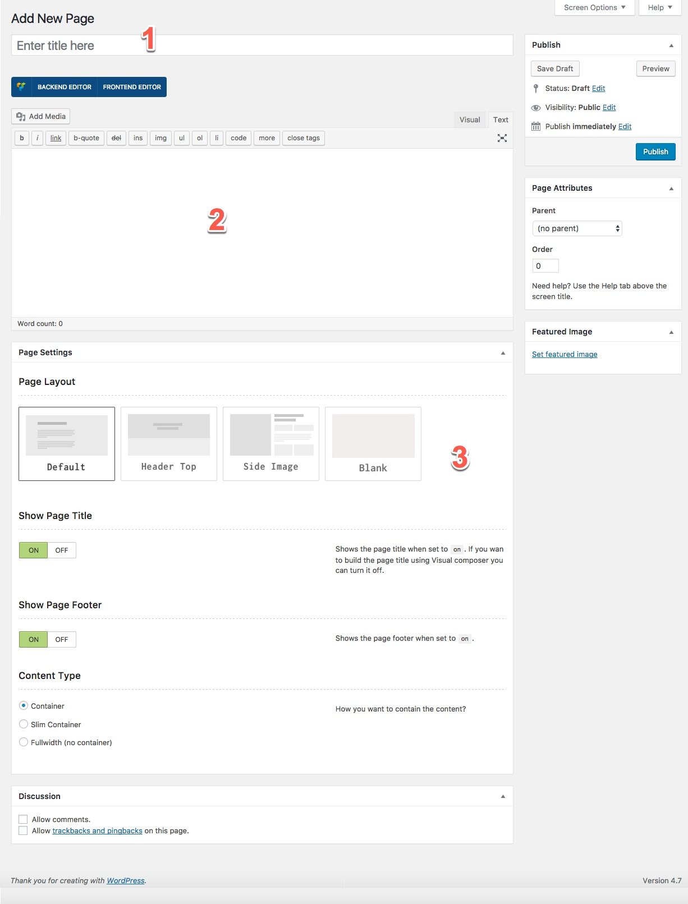
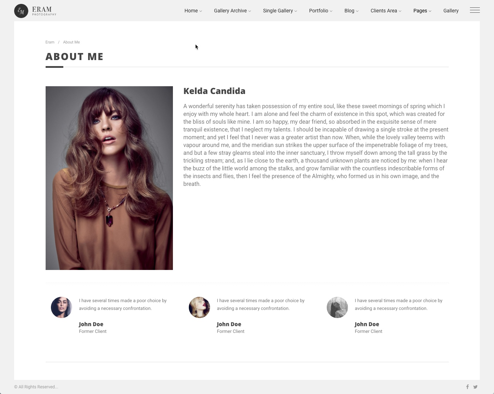
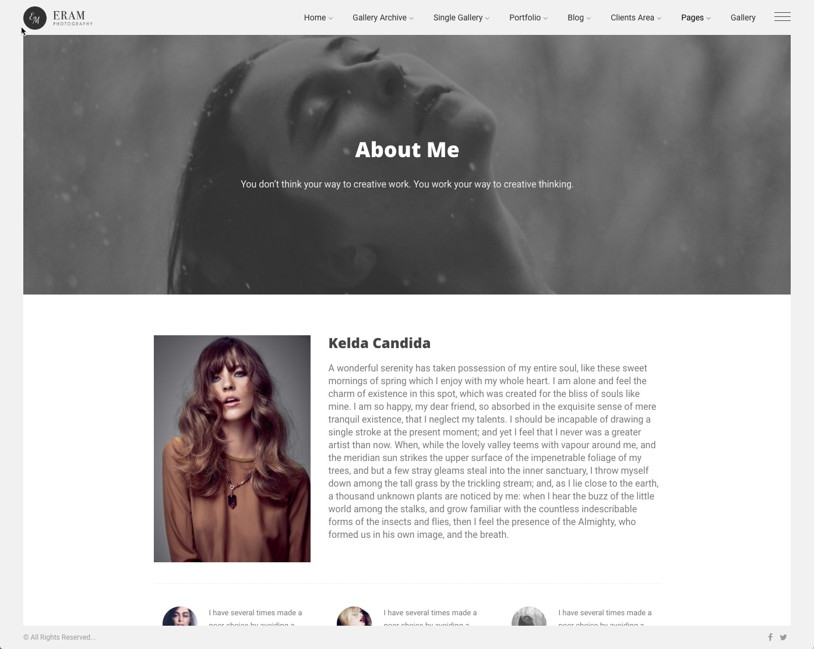
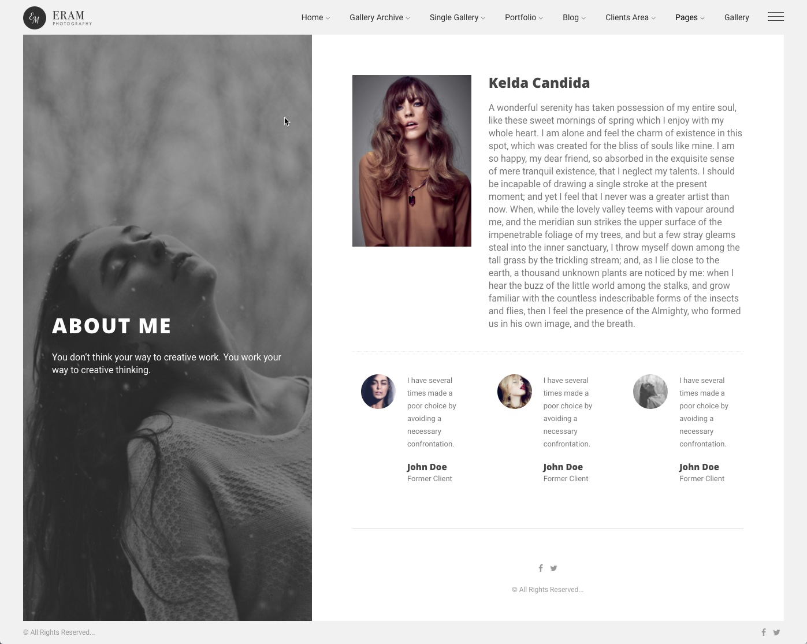

# ‌Pages

1. Title of the page
2. Content of the page
3. Page settings and layout
4. Cover image of the page

## Default Layout

This layout is an ordinary page with title and footer. 

## Header Top Layout

## Side Image

## Blank Layout

This layout provides a blank page that all is covered by the content, there are some special usecases for this, like adding a fullscreen gallery.

