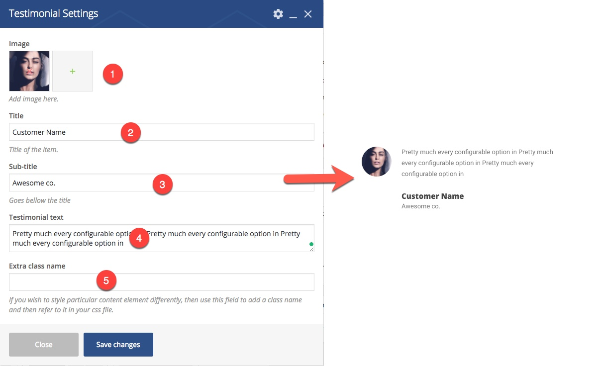

# ‌Theme Elements

The Eram theme provides a couple of content elements used along with the Visual Composer helping you build beautiful pages with ease. You see all provided content elements at Eram tab of the visual composers Add element window.

## Team member

 1. Photo 2. Name of the person 3. Subtitle is usually the occupation 4. link to a page 5. extra class name for customizaiton

## Image Compare

1. Befor Photo
2. Before Label
3. After Photo
4. After Label
5. extra class name for customizaiton

## Iconbox

1. Available Icon Library
2. search and choose icons
3. Heading text
4. Contents of the iconbox
5. A link below the contents
6. extra class name for customizaiton

## Price Table

1. cover photo for plan
2. plan name
3. subtitle which you can add extra details like price
4. features. You should keep each feature in a separate line
5. link
6. extra class name for customizaiton

## Testimonial

1. Photo or logo of your customer
2. Name of the customer
3. subtitle usually where they are from
4. testimony text
5. extra class name for customizaiton

## Rail Carousel

This element is a composite element which is a container for all slides and some slides inside it.

1. Background Type can be selected from three choices:
   * Solid Color which is set at theme css files
   * Background Image which you should set at each slide
   * Adaptive color which extracts the main color of each slides and sets it as the background color of the slide.
2. Theme is the coloring scheme of the slider
3. You can add overlay color here
4. Adds a 3D parallax effect on the slide
5. extra class name for customizaiton

 1. - 2. The main photo of the slide 3. Background Imahe 4. Mp4 Video URL \(Should be self hosted not youtube and vimeo\) 5. Title of the Slide 6. Description of the slide 7. Url of the slide 8. extra class name for customizaiton

## Double Carousel

This element is a composite element which is a container for all slides and some slides inside it.

1. Enables mouse wheel 
2. Enables keyboard navigation
3. Enables Touch navigation
4. Shows navigation bullets
5. Shows next/prev arrows
6. Autoplay
7. Shows numbers
8. Transition Duration
9. Autoplay duration
10. extra class name for customizaiton

1. Photo of the slide
2. Title of the slide
3. Description of the slide
4. url of the slide
5. extra class name for customizaiton

## Single Gallery

This element adds your gallery to the page, please notice that all of the layout and settings of the gallery are the same as you have set for it, this element just displays it.

1. Search and select the gallery
2. Gallery height
3. extra class name for customizaiton

## Call to action

1. The main title of the call to action
2. Sub heading 
3. url and button
4. icon library
5. search and select icon
6. coloring of texts if you want to set a background color or image for the parent row
7. extra class name for customizaiton

## Free Layer

This element serves as a container for your layer on top of another element, usually a fullscreen gallery or slider.

 You can choose if you want to position the layer on top of its parent row or if your page is a full screen page you can choose it to be on top of the page.

## Theme Button

1. Text on the button
2. url
3. size
4. shape
5. color
6. transparent
7. make it wider
8. Adds icon 
9. Adds animation to icon
10. icon alignment
11. icon library
12. choose the icon

## Lightbox Video

This element adds an image with an icon in top of it, when a user clicks on the image, it shows a video from external source inside a lightbox.

1. Cover Image
2. Video link from youtube or vimeo
3. overlay color on image
4. Adds mask reveal animation on image
5. Mask DIrection
6. extra class name for customizaiton

## Mask Image

This adds a nice mask reveal effect on the image.

1. choose the image
2. set the direction of the mask
3. extra class name for customizaiton

