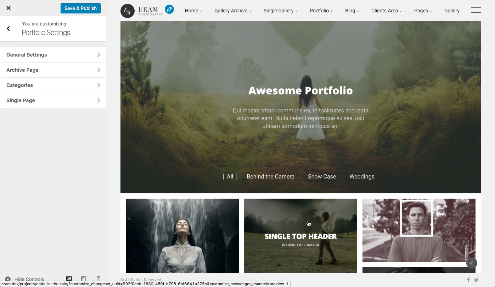

# Portfolio

> Galleries are used to show your photos, **portfolios** are intended to tell the stories behind them.

Portfolio is a fundamental part of a photography website to share stories and related information about a project, how it made, who where there and so many information that a potential visitor might need about how you work and your past experience.

Protfolio offers these page:

* **Archive Page** which lists all portfolio items
* **Taxonomy Page** which lists all portfolio items assigned to a taxonomy term
* **Single portfolio** Page which displays a portfolio item.

So lets begin with a creating a portfolio.

