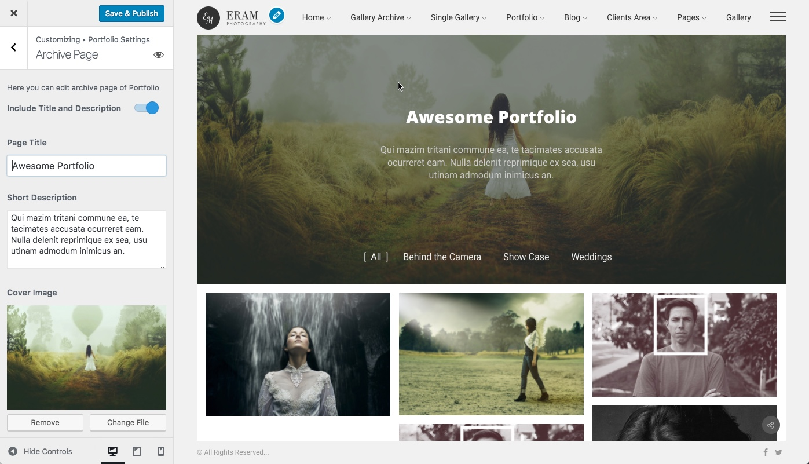
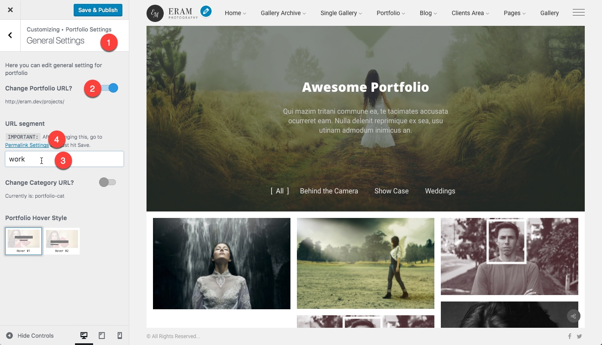
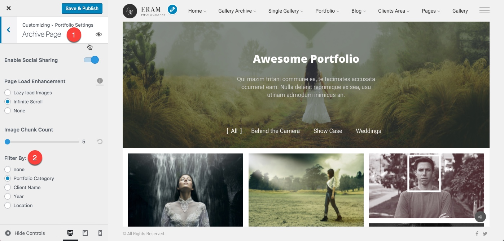
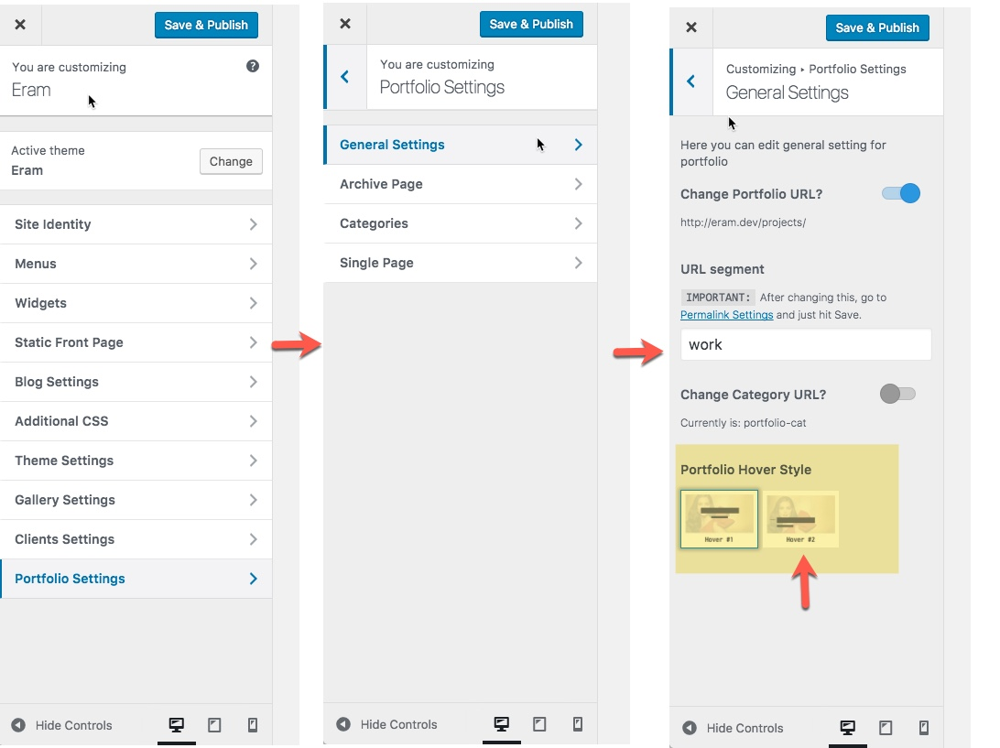

# Archives

Portfolio Archives

There are two types of archives available for portfolios.

* Archive Page
* Category Page

## Portfolio Archive Page

This page lists all your portfolio items and can be filterable based on what layout it uses. You don't need to Creat this page since it is already there out of the box.

All you need is to configure this page using the WordPress Customizer.



There it is possible to configure

* the header, title, and description of the page
* the cover image
* the layout of items
* Masonry
* Grid
* Justified
* Simple Vertical
* layout specific options like
* spacing
* number of rows
* number of columns
* loading type
* animation
* size of thumbnails
* Filtering

## Portfolio Category Page

Portfolio post type supports category. Categories are used to help you better organize your items in groups and display each group in separate pages.

First, you need to add some categories for portfolio and assign some items to each category, the category pages are already there out of the box and you don't need to create a page for them.

Each category page can be customized using WordPress _Customizer &gt; Portfolio settings &gt; Categories_. There you can select any category and set archive settings for it just like what you have at the archive page settings.

## How to Change URLs of Portfolio

You can change the URL of portfolio, for example, your portfolio is accessed by default at:

```text
http://yourwebsite.com/projects
```

Now you can change it to

```text
http://yourwebsite.com/works
```

How to do that is simple:

1. Go to WordPress Customizer &gt; Portfolio Settings &gt; General Settings and toggle on **Change Portfolio URL**
2. Change the URL Segment field from projects to works
3. Click on Save & publish
4. **Click on Permalink Settings URL and you need to hit Save on that page to refresh the permalinks.**

**Note:** URL Segment field must be URL friendly, avoid spaces, capital letters, and special characters.



Similarly, you can change the category permalinks using the **Change Category URL** option.

## Set Portfolio Filtering

Portfolio filtering is available for Masonry and Grid Layouts for Archive page only. You can set filtering not only on categories but on the year, client and even the custom fields that you have added to your portfolio. This is a unique feature of Eram theme that allows you to add filtering on your custom fields and meta boxes of the portfolio.



## Hover Effects

There are two variations for hover effect of gallery archive items, both archive page, and category pages share the same hover effect that can be set in the General settings of the Portfolio Settings Customizer Panel.



