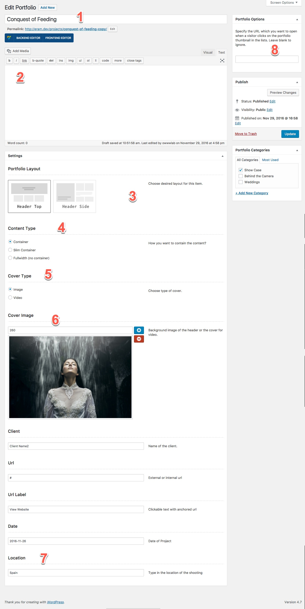
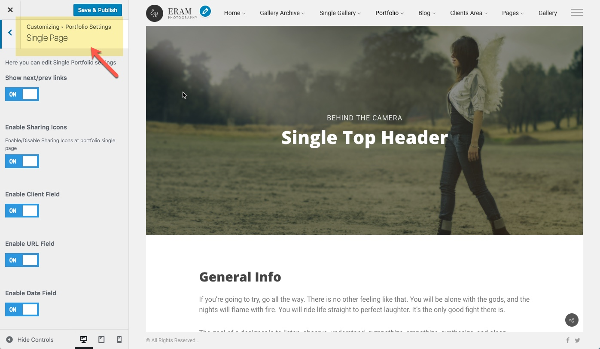
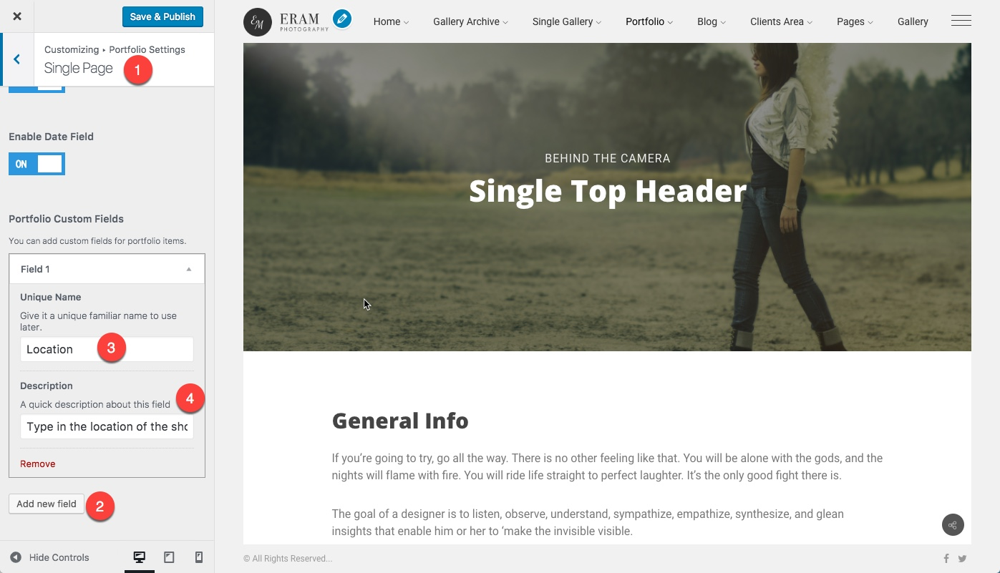

# Single

1. Portfolio Title
2. Portfolio Content.
3. Page Layout.
4. How to contain the content
5. cover image or vide type
6. portfolio cover image or video cover image
7. A custom field for portfolio
8. External URL for portfolio

## Customizer

You can change some aspects of the portfolio single item at the WordPress Customizer. These setting will affect all your portfolio items. Find this page at WordPress **Customizer &gt; Portfolio Settings &gt; Single Page**

## Custom Portfolio Field

You may come to this situation that depending on your works you need a field beside those already provided i.e. the client, the date, etc. You can add custom fields for portfolio items from customizer. As demonstrated in the below figure, you are required to add a name and optionally a description and you are all set.

## Custom URL

There is a possibility that you want an item with the title and cover image to be present in your portfolio list but you don't want to show the single page for it instead, you want to redirect to a different page or even an external URL. You can simply do this by providing that URL into the Portfolio Option box at the single admin page of that item.

