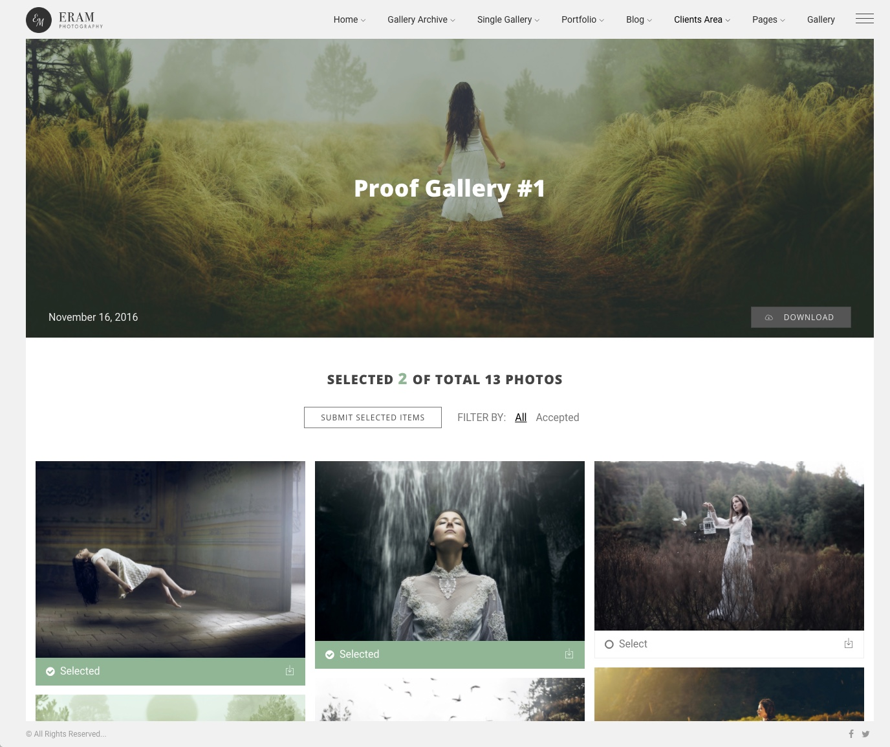
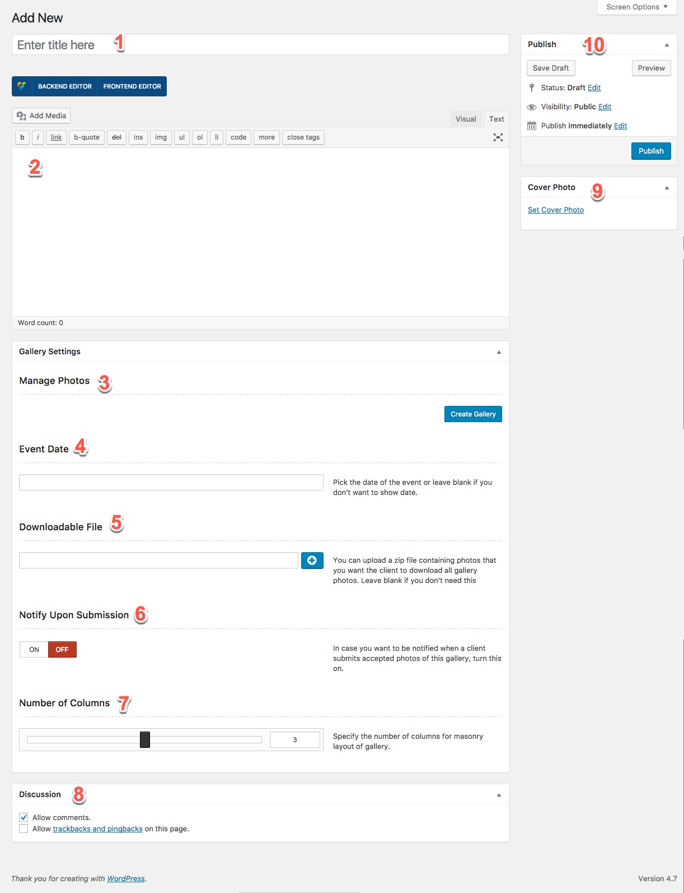
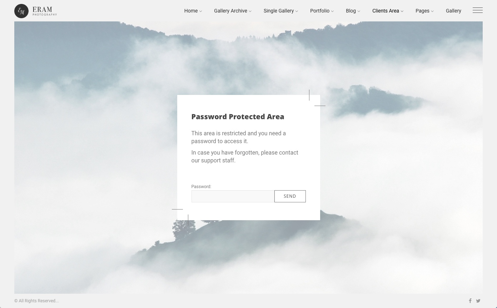
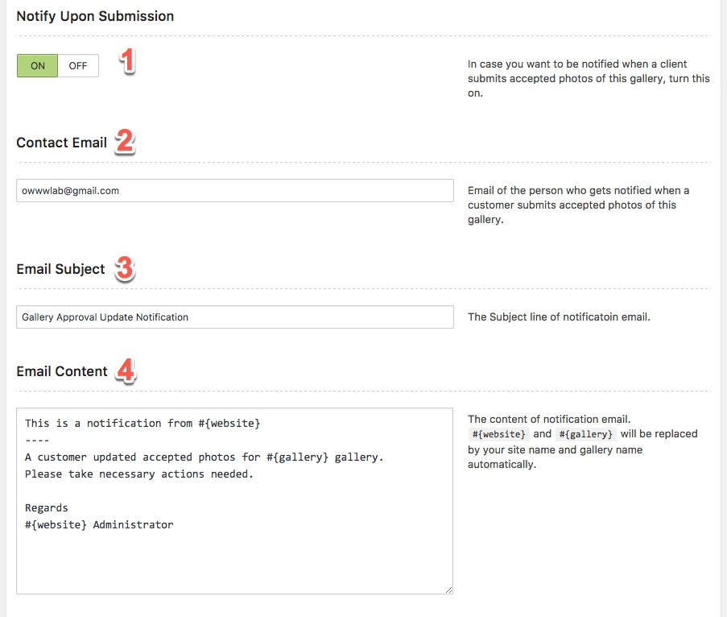

# Proof Gallery

## What is a Proof Gallery?

As a photographer you might need to get proof of your shots from the client. In the Proof Gallery that is provided by Eram Theme, it is possible to add shots and let the client to choose among them, then you can be notified from the selection and continue your workflow whatever it might be.

## How to Create a Proof Gallery?

Creating a proof gallery is simple. Click Add New and you will get this page.

1. Title of the proof gallery
2. Content of the page. This will be shown at the bottom of photos and above the comments area, so you might use this to display a message ot instruction for the client.
3. Add/Edit/Order photos.
4. Adds a Date to proof gallery.
5. If you want to provide a very high resolution of photos or any other files for this gallery, you can zip them all into a single file and upload it here. Anyone who has access to this gallery can  download  the file.
6. You can set if you want to get notified by eamil, every time that a client submits the selected photos.
7. Proof gallery has a masonry layout, you can change how many columns you want for it.
8. You can allow comments here.
9. Set a cover image for this gallery.
10. Standards WordPress publish meta box.

## How to make it Password Protected?

Just like any other page in WordPress you can click on Visibility and set a password for any individual proof gallery.

When a visitor wants to access this gallery, they should provide the password.

## Setting up Email Notification

To do this you should turn on the **Notify Upon Submission** option.

1. Activate / Deactivate the notification.
2. Email address that you want to the notofication to be sent to. 
3. Email Subject line
4. The content of the Email.

**Note:** There are two presereved varialble in the content of email. `#{website}` and `${gallery}`. These will be automatically converted to respective valuse, but are optional and you can compeletely use your own message body.

