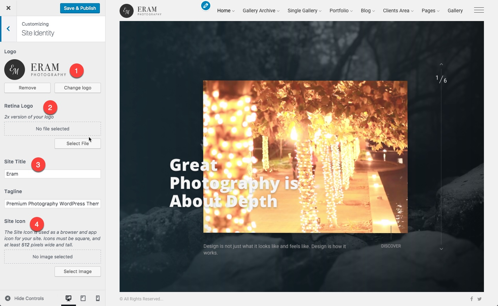
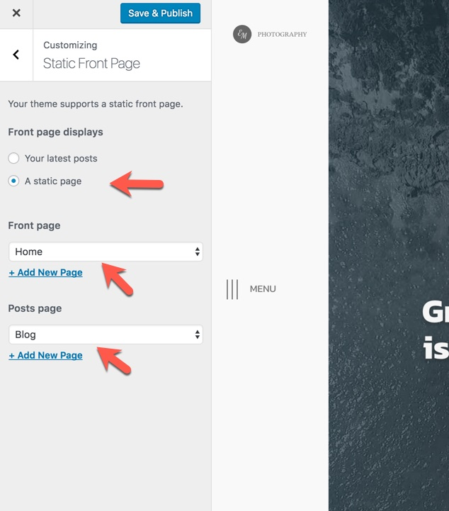
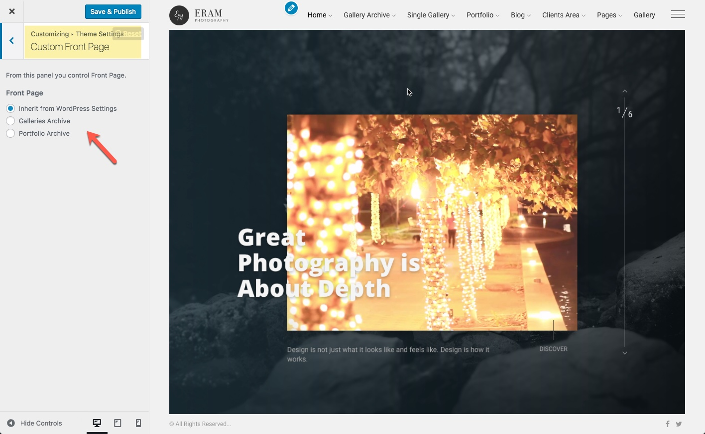
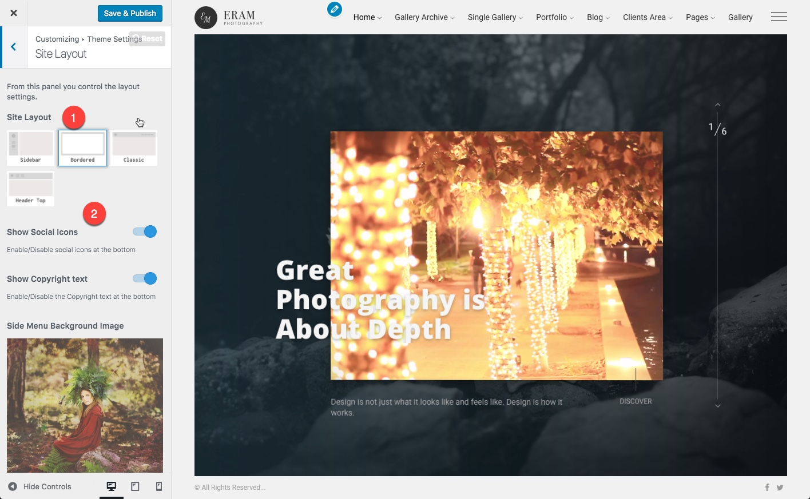
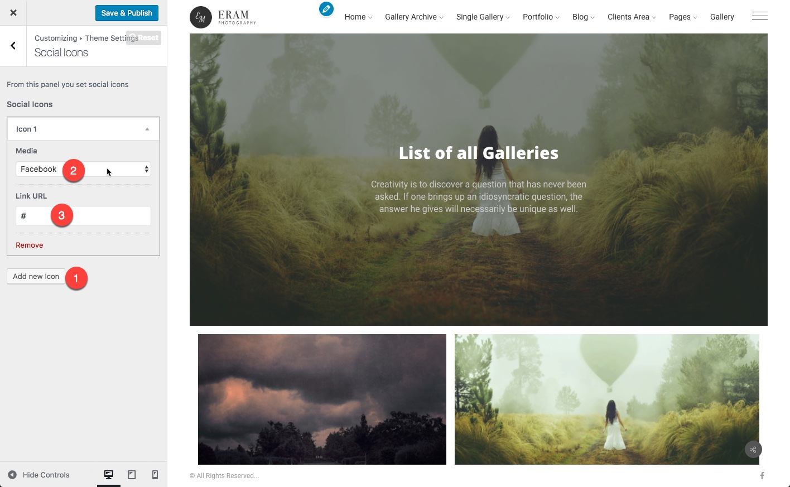
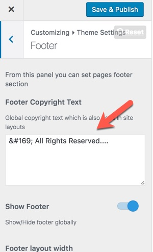
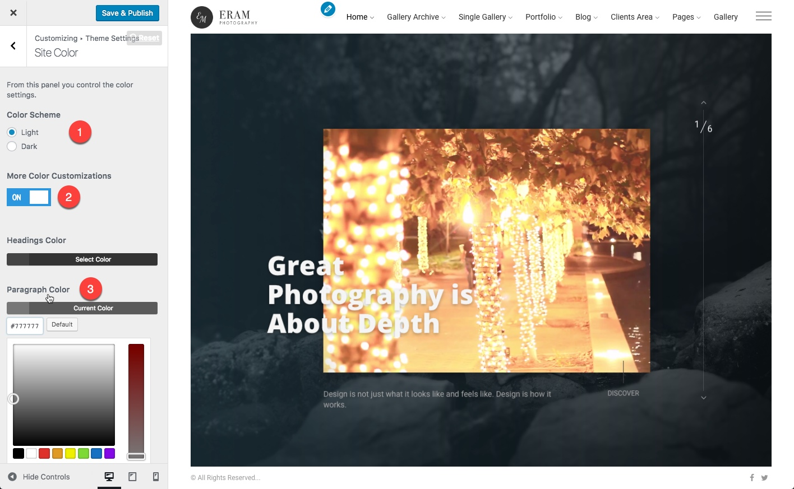

# Basic Settings

Here we briefly review basic settings which are first things that you would need to do for your website. Other settings will be explained in related sections.

## Logo and Website Identity

  
1. Logo of your website a png transparent logo.  
2. Retina logo is used for Retina display devices like iPad. This is the same as your logo except it is 2x larger.  
3. Your site name.  
4. The Site Icon is used as a browser and app icon for your site. Icons must be square, and at least 512 pixels wide and tall.

## Static Front page

By default WordPress shows recent posts in homepage and also has the capability of setting a static page as homepage. We also have added an extra option for setting portfolio or gallery archive as homepage.

If you want to change home to anything other than recent posts, **first you need to set it to a static page.** This can be done in Dashboard-&gt;appearance-&gt;Customize-&gt;Static Front Page :

After that If you need gallery archive or portfolio archive as your homepage, go to Dashboard-&gt;appearance-&gt;Customize-&gt;Theme Settings-&gt;Custom Front Page and set the Front Page option:

## Site Layout

This is a master option. You want to change it once. It can be changed later but you need to make a decision on which on these layouts you want for your website. Each Layout has it's own general layout settings which will be shown after you select the layout type.

1. Site layout
2. Related settings to each layout.

## Social Icons

From _Customizer &gt; Theme Settings &gt; Social icons_ you can add as many social icons as you want.

1. Add new item
2. Select the social media from the dropdown 
3. Insert your Profile Url
4. Repeat this for other icons

## Social Sharing

If you want visitors to be able to share your content from your website you need to configure this at _Customizer &gt; Theme Settings &gt; Social Sharing_ just like what you did at Social Icons section.

## Copyright Text

Copyright text has been used in some layouts like bordered and also in page footers. The related option is global and can be set in _Customizer-&gt;Theme settings-&gt;Footer:_

## Coloring Options

There are two main color schemes available with the Eram theme.  
1. Light \(mainly white\)  
2. Dark

You can choose one of these color schemes, after that if you want to modify colors based on the selected scheme, you can enable the customization option and there is is possible to change main colors of the theme. To do more you need to use the custom css section and define your colors. Ask for support if you need more help on this.

