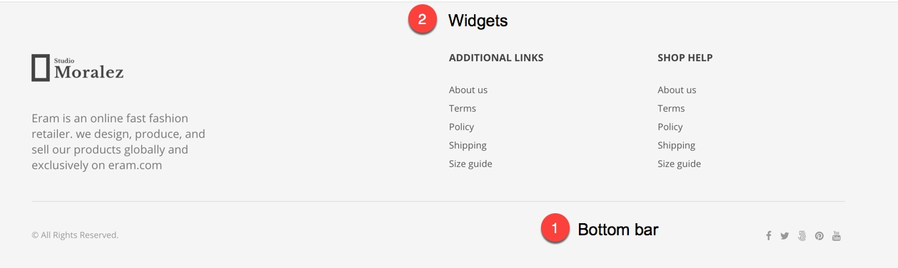
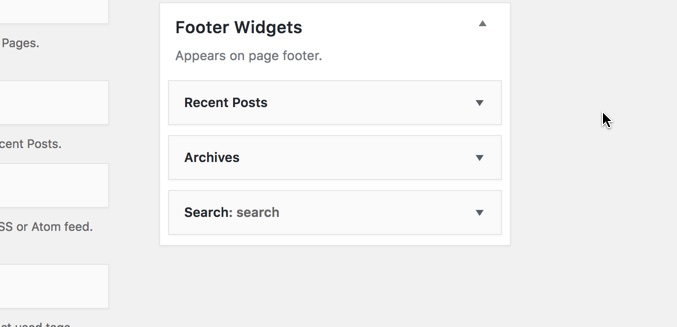

# Footer

A standard footer in Eram is consisted of two sections, widget area and bottom bar and it's related options are available in _Customizer-&gt;theme settings-&gt;footer_

Bottom bar has two parts which are usually used for a copyright text and social icons but can be any HTML elements as well. These can be set at the **Customizer &gt; Theme Settings &gt; Footer**

The Widgets Area at the footer is a widgetized area. You can set how many columns you want to have at the **Customizer &gt; Theme Settings &gt; Footer**  and then you can add widgets to it using **Appearance menu &gt; widgets page**  and adding widgets to **Footer Widgets** area.

